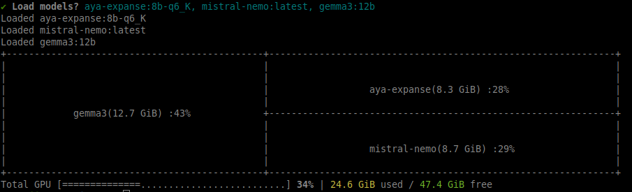
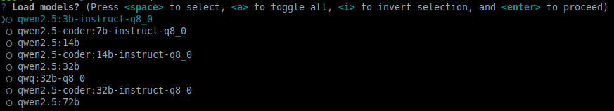

# Termollama

[](https://www.npmjs.com/package/termollama)

A Linux command line utility for Ollama. Features:

- Quick gpu vram usage stats
- Memory management: load and unload models
- A serve command with options

## Install

Requirements: the `nvidia-smi` command should be available on the system
as well as the `npm` command.

```bash
npm i -g termollama
```

The `olm` command is now available.

## Memory occupation stats

Run the `olm` command without any argument to display memory stats. Output:


Note the action bar at the bottom with quick actions shortcuts: it will stay
on the screen for 5 seconds and disapear. It allows quick actions:
- `m` → Show memory chart
- `l` → Load models
- `u` → Unload models
- `k` → Adjust keep alive
- `c` → Set context length

## Models

To list all the available models: `olm models` or `olm m`.

To search for a model with filters: `olm m qwen coder`

### Load models

Use the `olm load` or `olm l` command to list all the models and select some to load. Output after models selection:



To find models by name and load them use the command with your search arguments. Ouptut of
`olm l qw`:



### Unload models

Use the `olm unload` or `olm u` command to unload models. Pick the models to unload from the list.

### Keep alive

To modify the keep alive parameters per model use `olm keep-alive` or `olm k`. Pick a model in the list
and change the keep alive value.

Valid time values:
- `5m` → 5 minutes
- `2h` → 2 hours
- `1d` → 1 day

### Context window length

To set the context window used by an model loaded in memory run `olm ctx` or `olm c`

### Environment variables

To show the environment variables used by Ollama run `olm env` or `olm e`

## Instance options

To use a different instance than the default `localhost:11434`:

- **`-u, --use-instance <hostdomain>`**: Use a specific Ollama instance as the source. Example:
  ```bash
  olm models -u 192.168.1.8:11434
  ```
  This command will list the models from the Ollama instance running at `192.168.1.8` on port `11434`.

- **`-s, --use-https`**: Use HTTPS protocol to reach the Ollama instance.

## Serve command

An `olm serve` or `olm s` command is available, equivalent to `ollama serve` but with flag options.

### Usage

Note: an `olm env` command is available to display the environnement variables
used by Ollama

Options of `olm serve`:

- **Flash attention**: use the `--flash-attention` or `-f` flag to enable
- **Q4 kv cache**:use `--kv-4` or `-4` (note: this flag will turn flash attention on)
- **Q8 kv cache**:use `--kv-8` or `-8` (note: this flag will turn flash attention on)
- **Cpu**: use the `--cpu` flag to run only on cpu
- **Gpu**: provide a list of gpu ids to use: `--gpu 0 1` or `-g 0 1`
- **Keep alive**: to set the default keep alive time: `--keep-alive 1h` or `-k 1h`
- **Context length**: to set the default context length: `-ctx 8192` or `-c 8192`
- **Max loaded models**: max number of models in memory: `--max-loaded-models 4` or `-m 4`
- **Max queue**: set the max queue value: `--max-queue 50` or `-q 50`
- **Num parallel**: number of parallel requests: `--num-parallel 2` or `-n 2`
- **Port**: set the port: `--port 11485` or `-p 11485`
- **Host**: set the hostname: `--host 192.168.1.8`

### Examples

#### Key Options:
- **Flash Attention**: `-f` (improves performance)
- **KV Cache**: 
  - `-4` → `q4_0` quantization (low memory)
  - `-8` → `q8_0` quantization (balanced)
- **GPU/CPU**:
  - `--cpu` → Run on CPU only
  - `-g 0 1` → Use specific GPUs (e.g., GPUs 0 and 1)
- **Memory Management**:
  - `-k 1h` → Keep alive timeout (default 30m)
  - `-c 8192` → Default context length
- **Server Settings**:
  - `-p 11434` → Port (default 11434)
  - `-h 0.0.0.0` → Host address

```bash
olm s -fg 0
```

Run with flash attention on GPU 0 only

```bash
olm s -p 11385 -c 8192 --cpu
```

Run on localhost:11385 with a default context window of 8192 and using only the cpu


```bash
olm s -8k 10m -m 4
```

Use fp8 kv cache (flash attention will be used as well), models will stay loaded for ten minutes
and a max of 4 models can be loaded at the same time