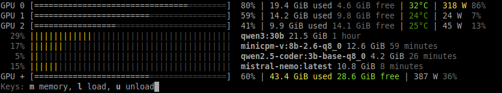

# Termollama

[](https://www.npmjs.com/package/termollama)

A Linux command line utility for [Ollama](https://github.com/ollama/ollama), a user friendly
 [Llamacpp](https://github.com/ggml-org/llama.cpp) wrapper. It displays info about 
 gpu vram usage and models and has these additional features:

- **Memory management**: load and unload models with different parameters
- **Serve command**: with flag options
- **Gguf utilities**: extract gguf files or links from the Ollama models blob

## Install

Requirements: the `nvidia-smi` command should be available on the system.

```bash
npm i -g termollama
# to update:
npm i -g termollama@latest
```

The `olm` command is now available.

## Memory occupation stats

Run the `olm` command without any argument to display memory stats. Output:



Note the action bar at the bottom with quick actions shortcuts: it will stay
on the screen for 5 seconds and disapear. It allows quick actions:
- `m` → Show a memory chart
- `l` → Load models
- `u` → Unload models

### Watch mode

To monitor the activity in real time:

```bash
olm -w
```

#### Options

- `-m, --max-model-bars <number>`: Set the maximum number of model bars to display. Defaults to `OLLAMA_MAX_LOADED_MODELS` if set, otherwise 3 × number of GPUs.

#### Environment Variables

- `TERMOLLAMA_TEMPS`: Set temperature thresholds as comma-separated values (low, mid, high) for color-coding.  
  Example:  
  ```bash
  export TERMOLLAMA_TEMPS="30,55,75"
  ```
- `TERMOLLAMA_POWER`: Set power usage threshold percentage for color-coding.  
  Example:  
  ```bash
  export TERMOLLAMA_POWER="20"
  ```

## Models

To list all the available models:

```bash
olm models
# or
olm m
```

To search for a model with filters:

```bash
olm m qwen
```

### Load models

List all the models and select some to load:

```bash
olm load
# or
olm l
```

You can specify optional parameters when loading:

- `--ctx` or `-c`: Set the context window (e.g., `2k`, `4k`, `8192`).
- `--keep-alive` or `-k`: Set the keep alive timeout (e.g., `5m`, `2h`).
- `--ngl` or `-n`: Number of GPU layers to load.

#### Examples:

1. **Basic load with search**:
   ```bash
   olm l qw
   ```
   This searches for models containing "qw" and lets you select from the filtered list. Example output:

   

2. **Load with context and keep alive**:
   ```bash
   olm load --ctx 8k --keep-alive 1h mistral
   ```
   Search for "mistral" models and load with an 8k context window and a 1 hour keep alive time.

3. **Specify GPU layers**:
   ```bash
   olm l --ngl 40 qwen3:30b
   ```
   Loads qwen3:30b model with 40 GPU layers, the rest will go to ram.

Filters can be combined (e.g., `olm l qwen3 4b` finds models with both terms). The selected models are loaded into memory with interactive prompts for parameters if not specified via flags.

### Unload models

To unload models:

```bash
olm unload
# or
olm u
```

Pick the models to unload from the list.

## Serve command

A serve command is available, equivalent to `ollama serve` but with flag options.

```bash
olm serve
# or
olm s
```

Serve command options directly map to environment variables (they are changed within the process only):

| Option Flag          | Environment Variable      |
|----------------------|---------------------------|
| `--flash-attention`  | `OLLAMA_FLASH_ATTENTION`  |
| `--kv-4`             | `OLLAMA_KV_CACHE_TYPE=q4_0`|
| `--kv-8`             | `OLLAMA_KV_CACHE_TYPE=q8_0`|
| `--keep-alive`       | `OLLAMA_KEEP_ALIVE`       |
| `--ctx`              | `OLLAMA_CONTEXT_LENGTH`   |
| `--max-loaded-models`| `OLLAMA_MAX_LOADED_MODELS`|

### Usage

Options of `olm serve`:

- **Flash attention**: use the `--flash-attention` or `-f` flag to enable
- **Q4 kv cache**:use `--kv-4` or `-4` (note: this flag will turn flash attention on)
- **Q8 kv cache**:use `--kv-8` or `-8` (note: this flag will turn flash attention on)
- **Cpu**: use the `--cpu` flag to run only on cpu
- **Gpu**: provide a list of gpu ids to use: `--gpu 0 1` or `-g 0 1`
- **Keep alive**: to set the default keep alive time: `--keep-alive 1h` or `-k 1h`
- **Context length**: to set the default context length: `-ctx 8192` or `-c 8192`
- **Max loaded models**: max number of models in memory: `--max-loaded-models 4` or `-m 4`
- **Max queue**: set the max queue value: `--max-queue 50` or `-q 50`
- **Num parallel**: number of parallel requests: `--num-parallel 2` or `-n 2`
- **Port**: set the port: `--port 11485` or `-p 11485`
- **Host**: set the hostname: `--host 192.168.1.8`
- **Models registry**: set the directory for models registry: `--registry ~/some/path/ollama_models` or `-r ~/some/path/ollama_models`

#### Key Options:

- **Flash Attention**: `-f`
- **KV Cache**: 
  - `-4` → `q4_0` quantization (low memory)
  - `-8` → `q8_0` quantization (balanced)
- **GPU/CPU**:
  - `--cpu` → Run on CPU only
  - `-g 0 1` → Use specific GPUs (e.g., GPUs 0 and 1)
- **Memory Management**:
  - `-k 15m` → Keep alive timeout
  - `-c 8192` → Default context length
- **Server Settings**:
  - `-p 11434` → Port (default 11434)
  - `-h 0.0.0.0` → Host address

### Examples

```bash
olm s -fg 0
```

Run with flash attention on GPU 0 only

```bash
olm s -c 8192 --cpu
```

Run with a default context window of 8192 using only the cpu

```bash
olm s -8k 10m -m 4
```

Use fp8 kv cache (flash attention will be used), models will stay loaded for ten minutes
and a max of 4 models can be loaded at the same times

```bash
olm s -p 11385 -r ~/some/path/ollama_models
```

Run on localhost:11385 with a custom models registry directory: use an empty directory to create a new registry


### Environment variables info

To show the environment variables used by Ollama:

```bash
olm env
# or
olm e
```

| Variable                | Description                                                                 |
|-------------------------|-----------------------------------------------------------------------------|
| `OLLAMA_FLASH_ATTENTION`| Enable flash attention (1 to enable)                                       |
| `OLLAMA_KV_CACHE_TYPE`   | Set KV cache quantization (e.g. `q4_0`, `q8_0`)                           |
| `OLLAMA_KEEP_ALIVE`      | Default keep alive timeout (e.g. `5m`, `2h`)                              |
| `OLLAMA_CONTEXT_LENGTH`  | Default context window length (e.g. `4096`)                               |
| `OLLAMA_MAX_LOADED_MODELS`| Maximum number of models to load simultaneously                          |
| `OLLAMA_MAX_QUEUE`       | Maximum request queue size                                                |
| `OLLAMA_NUM_PARALLEL`    | Number of parallel requests allowed                                       |
| `OLLAMA_HOST`            | Server host address (default `localhost`)                                 |
| `OLLAMA_MODELS`          | Custom models registry directory                                          |
| `CUDA_VISIBLE_DEVICES`   | GPU selection (use `-1` to force CPU mode) 

## Instance options

To use a different instance than the default `localhost:11434`:

- **`-u, --use-instance <hostdomain>`**: Use a specific Ollama instance as the source. Example:
  ```bash
  olm models -u 192.168.1.8:11434
  ```
  This command will list the models from the Ollama instance running at `192.168.1.8` on port `11434`.

- **`-s, --use-https`**: Use HTTPS protocol to reach the Ollama instance.

## Information about gguf files

### Show registries info

To show information about gguf models located in the Ollama internal registries:

```bash
olm gguf
# or
olm g
```

This will display information about models from the Ollama model storage registries. Ouptut:

```
---------  Registry hf.co/bartowski ---------
hf.co/bartowski
   NousResearch_DeepHermes-3-Llama-3-8B-Preview-GGUF (1 model)
    - Q6_K_L

---------  Registry ollama.com ---------
ollama.com
   deepseek-coder-v2 (1 model)
    - 16b-lite-instruct-q8_0

---------  Registry registry.ollama.ai ---------
registry.ollama.ai
  gemma3 (3 models)
    - 12b
    - 27b
    - 4b-it-q8_0
  ...
```

### Show model info 

To show information about a specific model:

```bash
olm gguf -m qwen3:0.6b
```

Output:

```
Model qwen3:0.6b found in registry registry.ollama.ai
  size: 498.4 MiB
  quant: Q4_K_M
  blob: /home/me/.ollama/blobs/sha256-7f4030143c1c477224c5434f8272c662a8b042079a0a584f0a27a1684fe2e1fx
  link: ln -s /home/me/.ollama/blobs/sha256-7f4030143c1c477224c5434f8272c662a8b042079a0a584f0a27a1684fe2e1fx qwen3_0.6b_Q4_K_M.gguf
```

The link can be used to create a regular gguf file name symlink from the blob, and use it with [Llamacpp](https://github.com/ggml-org/llama.cpp) and friends.

### Show template info

To show a model's template:

```bash
olm gguf -t qwen3:0.6b
```

### Exfiltrate Model Blob

To exfiltrate a model blob to a gguf file:

```bash
olm gguf -x qwen3:0.6b /path/to/destination
```

This command will copy the model data from its original location to the specified destination, rename it to a `.gguf` file, and replace the original blob with a symlink pointing to the new file. Use case: to move the model to another storage location. *Use at your own risks*.

### Copy Model Blob

To only copy a model blob without replacing the original:

```bash
olm gguf -c qwen3:0.6b /path/to/destination
```

This command will perform the same steps as the exfiltrate command but will not replace the original blob with a symlink.
